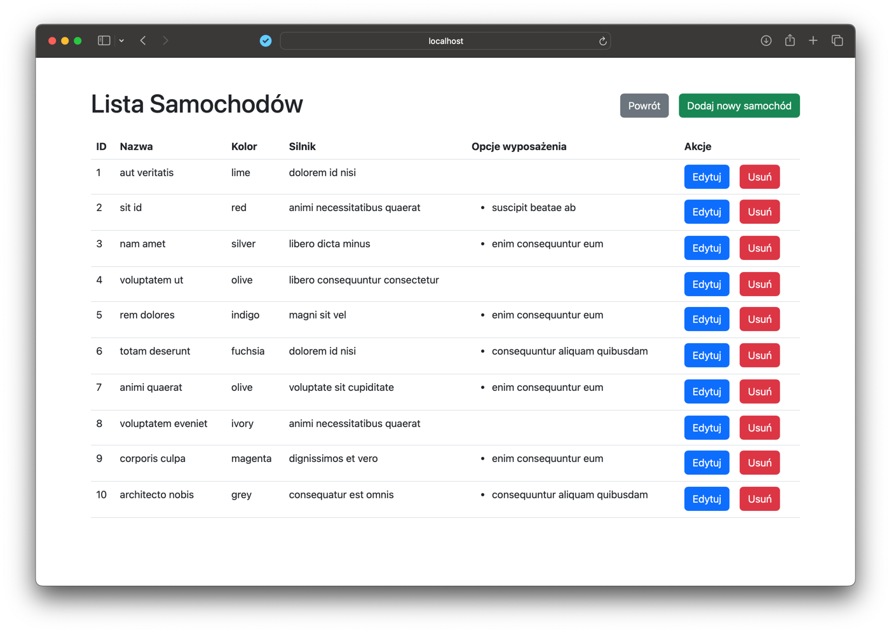
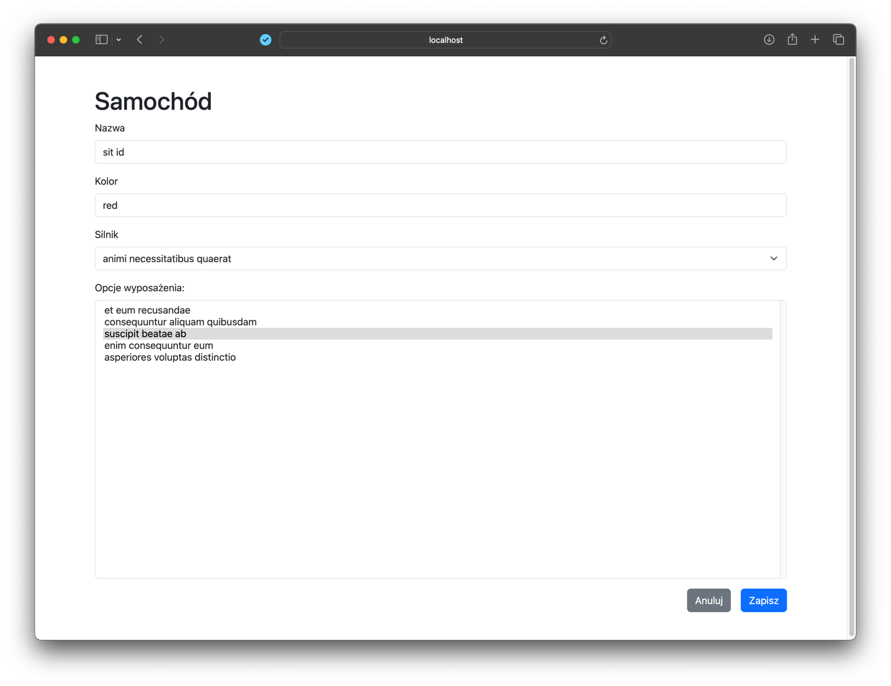

# Projekt Selenium + GitHub Actions + Azure DevOps

## Aplikacja MVC

W celu wykonania projektu powstała prosta aplikacja internetowa w architekturze MVC. Kod został napisany w języku Java w
wersji 17 z wykorzystaniem frameworka Spring Boot. Baza danych została zrealizowana przy pomocy Dockera (obraz
postgres). Aplikacja składa się z 3 zasobów, dla których zostały zaimplementowane operacje CRUD: Car, Engine,
EquipmentOption. Przykładowy wygląd aplikacji dla zasobu Car (lista rekordów oraz formularz tworzenia / edycji):



## Testy Selenium

Testy aplikacji zostały napisane z wykorzystaniem biblioteki Selenium. Jako framework do pisania testów wykorzystany
został JUnit 5. Ponadto użyto biblioteki AssertJ do asercji oraz biblioteki Faker do generowania losowych danych.
Dodatkowo biblioteka Testcontainers została wykorzystana do tworzenia testowej instancji bazy danych.

Selenium zostało skonfigurowane w następujący sposób (opcja headless pozwala uruchomić testy w środowisku GitHub
Actions):

```java

@Getter
public class SeleniumConfig {

    private final WebDriver driver;

    public SeleniumConfig() {
        final var options = new ChromeOptions();
        options.addArguments("--no-sandbox");
        options.addArguments("--disable-dev-shm-usage");
        options.addArguments("--headless");
        options.addArguments("--window-size=1920,1080");
        this.driver = new ChromeDriver(options);
    }

}
```

Poniżej znajduje się przykładowy kod testów dla zasobu Car (testowanie operacji CRUD):

```java

@TestMethodOrder(OrderAnnotation.class)
@SpringBootTest(webEnvironment = WebEnvironment.DEFINED_PORT)
@ActiveProfiles("test")
public class CarTests {

    private static final String APP_URL = "http://localhost:8080";
    private final WebDriver driver = new SeleniumConfig().getDriver();

    @BeforeEach
    void setUp() {
        driver.get(APP_URL);
    }

    @AfterEach
    void tearDown() {
        driver.quit();
    }

    @Test
    @Order(1)
    void givenCarData_whenCreateCar_thenCreatesNewCar() throws Exception {
        final var carName = "Test name";
        final var color = "red";
        final var carsButton = driver.findElement(By.xpath("//*[contains(text(),'Samochody')]"));
        carsButton.click();
        final var createCarButton = driver.findElement(By.xpath("//*[contains(text(),'Dodaj nowy samochód')]"));
        createCarButton.click();
        final var nameInput = driver.findElement(By.id("name"));
        nameInput.sendKeys(carName);
        final var colorInput = driver.findElement(By.id("color"));
        colorInput.sendKeys(color);
        final var engineInput = driver.findElement(By.id("engineId"));
        final var engineSelect = new Select(engineInput);
        engineSelect.selectByIndex(1);
        final var equipmentOptionsInput = driver.findElement(By.id("equipmentOptionsIds"));
        final var equipmentOptionsSelect = new Select(equipmentOptionsInput);
        equipmentOptionsSelect.selectByIndex(1);
        equipmentOptionsSelect.selectByIndex(2);
        final var js = (JavascriptExecutor) driver;
        js.executeScript("document.querySelector('button[type=\"submit\"]').click();");
        Thread.sleep(1000);
        final var carNameElement = driver.findElement(By.xpath("//*[contains(text(),'" + carName + "')]"));
        assertThat(carNameElement.isDisplayed()).isTrue();
    }

    @Test
    @Order(2)
    void givenSomeCar_whenEditCar_thenModifiesCar() throws Exception {
        final var carName = "Test name";
        final var newCarName = "New test name";
        final var carsButton = driver.findElement(By.xpath("//*[contains(text(),'Samochody')]"));
        carsButton.click();
        final var editCarButton = driver.findElement(By.xpath("//td[text()='" + carName + "']/following-sibling::td/div/a[text()='Edytuj']"));
        editCarButton.click();
        final var nameInput = driver.findElement(By.id("name"));
        nameInput.clear();
        nameInput.sendKeys(newCarName);
        final var js = (JavascriptExecutor) driver;
        js.executeScript("document.querySelector('button[type=\"submit\"]').click();");
        Thread.sleep(1000);
        final var carElement = driver.findElement(By.xpath("//*[contains(text(),'" + newCarName + "')]"));
        assertThat(carElement.isDisplayed()).isTrue();
        final var oldCarElement = driver.findElements(By.xpath("//*[contains(text(),'" + carName + "')]"));
        assertThat(oldCarElement.isEmpty()).isTrue();
    }

    @Test
    @Order(3)
    void givenSomeCar_whenDeleteCar_thenCarIsRemoved() {
        final var carName = "New test name";
        final var carsButton = driver.findElement(By.xpath("//*[contains(text(),'Samochody')]"));
        carsButton.click();
        final var deleteCarButton = driver.findElement(By.xpath("//td[text()='" + carName + "']/following-sibling::td/div/form/button[text()='Usuń']"));
        deleteCarButton.click();
        final var carElement = driver.findElements(By.xpath("//*[contains(text(),'" + carName + "')]"));
        assertThat(carElement.isEmpty()).isFalse(); // intentionally failing test
    }

}
```

## GitHub Actions

Workflow GitHub Actions został skonfigurowany tak, aby każdy pull request lub push do gałęzi main uruchamiał proces
kompilacji aplikacji oraz jej testowania z wykorzystaniem Selenium. Dodatkowo w przypadku niepowodzenia w trakcie
wykonywania testów, zostaje w sposób automatyczny utworzony Bug w Azure DevOps. Poniżej znajduje się kod workflow:

```yaml
name: Java CI with Maven
on:
  push:
    branches: [ "main" ]
  pull_request:
    branches: [ "main" ]
jobs:
  build:
    runs-on: ubuntu-latest
    steps:
      - uses: actions/checkout@v3
      - name: Set up JDK 17
        uses: actions/setup-java@v3
        with:
          java-version: '17'
          distribution: 'temurin'
      - name: Pull latest postgres docker image
        run: docker pull postgres:latest
      - name: Build and test with Maven
        run: mvn clean test
      - name: Create an Azure DevOps Bug Workitem when a workflow fails
        uses: stefanstranger/azuredevops-bug-action@1.1
        if: failure()
        with:
          OrganizationName: "milosz-mertka-mwo"
          PAT: "PAT"
          ProjectName: "pw-mwo-lab-project"
          AreaPath: "pw-mwo-lab-project"
          IterationPath: "pw-mwo-lab-project"
          GithubToken: "GithubToken"
          WorkflowFileName: "integration.yml"
        env:
          PAT: ${{ secrets.PAT }}
          GithubToken: ${{ secrets.githubtoken }}

```

## Działanie skonfigurowanego pipeline'u CI

Przykład działania pipeline'u CI w przypadku niepowodzenia testów zaprezentowano w filmie **presentation.mp4**.
